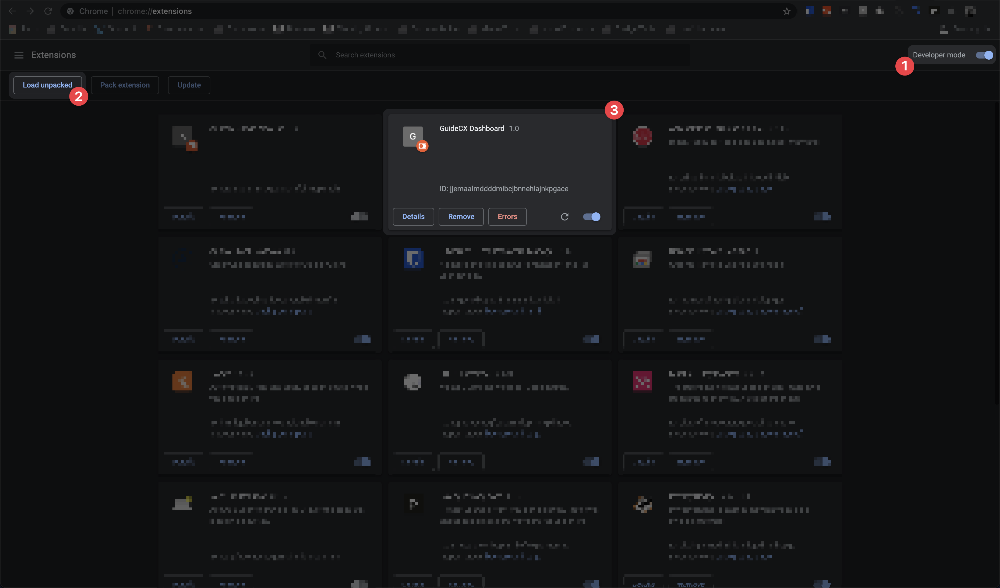

# NewTab Chrome Extension: Vitals Dashboard

This repo contains the code (front- and back-end) necessary to override the `newtab` page in Chromium browsers.

Currently, the dashboard displays the following data:

- [x] Open Pull Requests assigned to you
- [ ] Upcoming Calendar Events (Outlook)
- [x] Assigned Shortcut Stories
- [ ] New Relic Health Check
- [x] Current On-Call
- [x] BugSnag
  - [x] Recently Introduced Bugs
- [ ] Open Intercom Conversations
- [x] Trending (Hot) Post from `r/programmerhumor`
- [ ] Harness apps awaiting deploy
  - [ ] Most recently deployed PR
- [x] Poker Bank top 3
- [ ] Reading / Viewing List
  - [ ] Source from email newsletters, bookmarks folder, slack messages, gist, etc
  - [ ] Archive read articles

## Setup

At a glance, these are the things you'll need to do to get the extension running locally:

1. update .env file with valid values
2. run server manually or with Automator app
3. install chrome extension

---

### Environment Variables

To add your own environment variables, run `cp remix/.env.example remix/.env`. This will create the boilerplate file for you to start adding correct values to.

#### Github Token

To generate your github personal access token, navigate to `settings > developer settings > personal access tokens`, and create a new token with the following permissions:

- notifications
- read:org
- read:repo_hook
- read:user
- repo
- user:email

#### Shortcut Token

To retrieve your Shortcut API token, navigate to `settings > API Tokens` and create a new token. That's it!

### Run Server on Login

On Mac, it is very easy to start the server on-boot. To do this, you'll need to globally install `pm2` via `npm i -g pm2`

###### Here is a [helpful URL](https://pm2.keymetrics.io/docs/usage/startup/) that will explain the steps below.

Once installed, you can do the following:

1. run `pm2 startup` - this will return another command to run
2. run the command returned from step 1
3. navigate to this `vitals-dashboard/remix`
4. run `npm run build` to generated a production-ready app
5. run `pm2 start server/index.js` on the output
6. `pm2 list` to verify that the server status is started. you can also verify this by opening up the newtab page (after installing the extension). if data gets returned from the api calls, pm2 is working correctly
7. run `pm2 save`. once this is run, any pm2 process that is currently running will start up when your computer reboots

NOTE: pm2 will _not_ run on every login; just reboots. if this turns out to be a problem, instructions will be added to [use the Automator app](https://stackoverflow.com/questions/6442364/running-script-upon-login-mac).

### Install Chrome Extension

Note: If you haven't already, run `npm run build` script in the `extension` folder to generate the minified files.

To install the chrome extension, open `chrome://extensions`, then enable `Developer Mode` at the top-right part of the page.

Clicking the `Load Unpacked` button will open up the file explorer. Navigate to this repo on your drive, and select the entire `extension/public` folder.

Once the extension has been loaded, open a new tab. Everything has been set up correctly, you should see the new dashboard, and after a few moments, it will be populated with your personal vitals!

## Local Testing

To run the vitals dashboard without installing the chrome extension or running the node server on boot, follow the instructions below.

Both the frontend and backend need to be running for the application to work.

### Frontend

1. Navigate to the `extension` folder, and run `npm install`
2. Run `npm start`. runs `live-server` against the public directory, and will open a new browser tab that has hot-reloading enabled.

Note: If you want to update styles, you'll need to open another terminal tab at this same path and run `npm run css:watch`

### Backend

1. Navigate to the `remix` folder
2. Verify that you have a `.env` file, and it has correct values in it (instructions above, if needed)
3. Run `npm start` in one terminal pane, and `npm run start:dev` in another

## Roadmap

- [ ] allow for dashboard customizations (eg: `GITHUB_ENABLED`, `GITHUB_POSITION` variables)
- [ ] add dark mode
- [ ] host server for mobile version & long-term storage
- [x] show loading states for cards fetching data
- [ ] show empty states when no data is available
- [ ] add server-side caching to speed up page load
- [x] Rebuild with Remix
